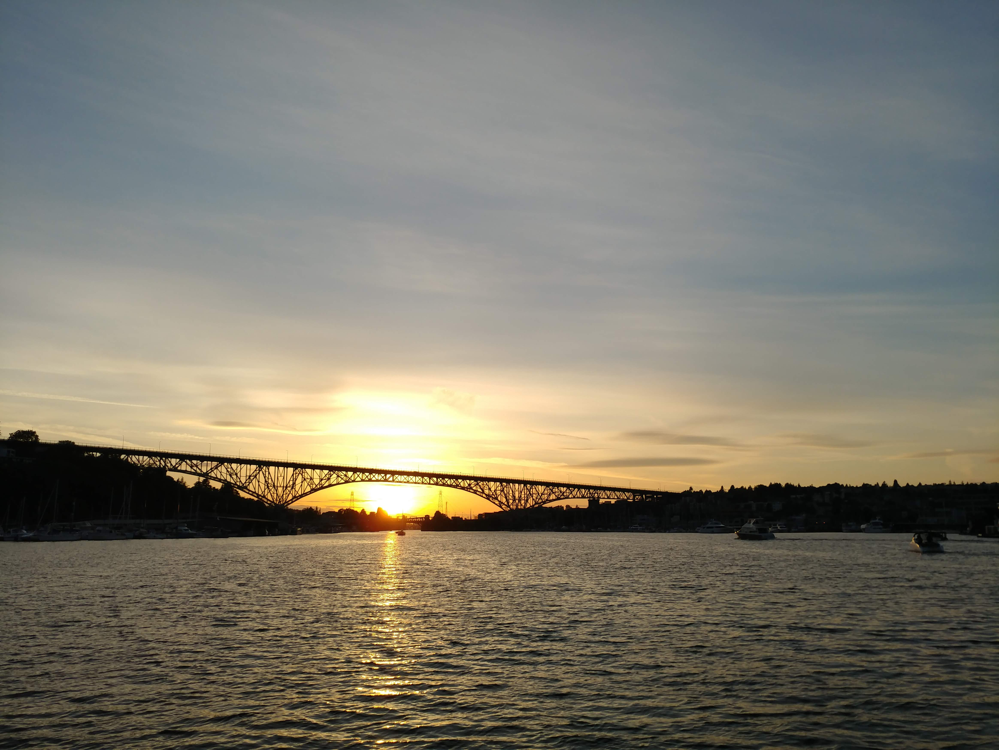
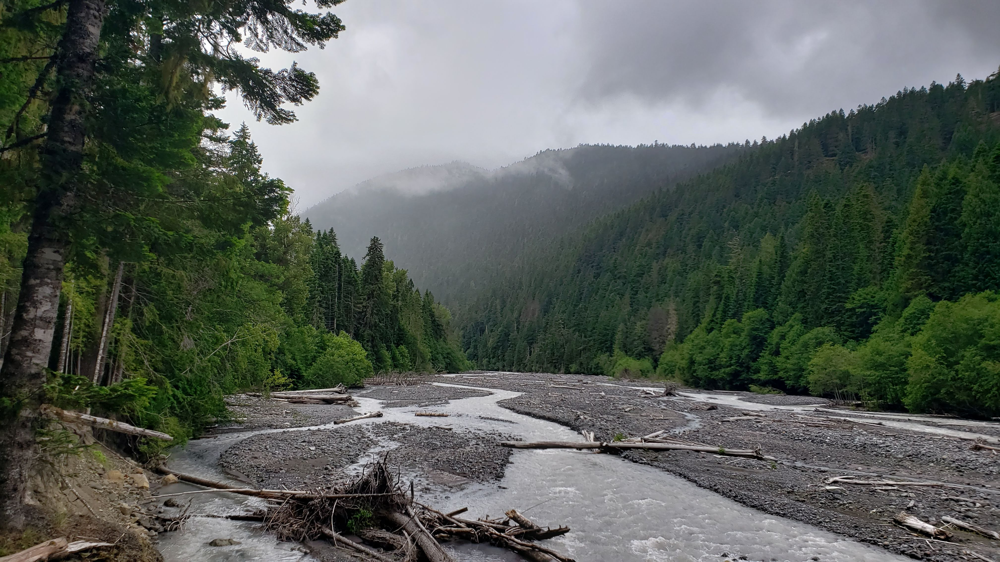

# Portfolio Prep

## About Me

### A two or three word catchy title. Do NOT use cliches like “programming ninja” or “coding rockstar”.

Some ideas:

1. The Coding Dad
2. About Me
3. Beyond Syntax
4. Adventures In Code

### A personal headline, like you have atop your LinkedIn page. What do you want your career to be about?

Hello, and welcome to my portfoio. I am a full stack software developer with devops tendancies. I enjoy working as part of a team and at times on my own. I have been focusing on creating products that benefits in some way the people who use them. I love tinkering with hardware and setting up systems.

### Your professional pitch: You’ve done a recording, so just write down here how it goes.

Hi I'm Will. I've worn many hats over my career so far, starting with QA egineer, and Software Developer. I've also been a chimney sweep, catering associate, warehouse manager, window delivery driver, gas meter tech. Most recently, my working time is spent as a Full Stack Developer. I like to spend my free time with my daughter and partner, my house plants, and learning DevOps. I enjoy tinkering on my homelab as a hobby and as a way to grow my skills.  I've been coding and working with technology for 20 years now. The excitement from finding interesting solutions to interesting problems has never gone away for me. I like learning new technology and figuring out how it can best be used. I'm looking to use my skills to help make the world a better place for my child, and everyone else in our community, state, country, and maybe even beyond.

### What excites you the most about tech? Write 1-2 sentences.

I really enjoy learning how things work, like games or systems, and then pushing those things to their limits to see just what they can accomplish. I'm always chasing that hit of excitement and happiness when something works as you intended it to. I'm always excited to see new technology come out and getting to learn it is always a joyful endevor!

## Image Assets

### Background images

### Memory Snap - 201 Final Project

### Odd Duck

### Salmon Cookies

